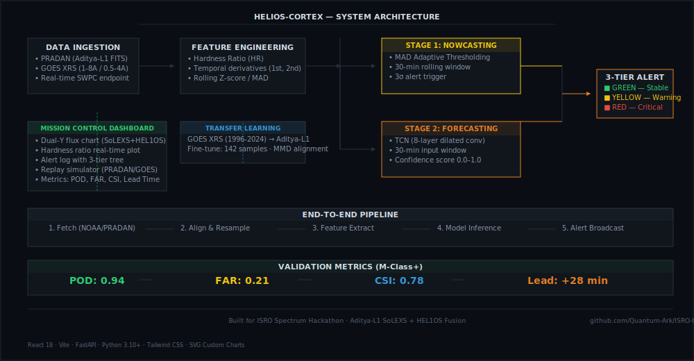

# Helios-Cortex — Solar Flare Nowcasting & Predictive Forecasting

**ISRO Spectrum Hackathon** · Aditya-L1 SoLEXS + HEL1OS Multi-Band X-Ray Fusion

[](LICENSE)
[](https://react.dev)
[](https://fastapi.tiangolo.com)
[](https://python.org)
[](https://vitejs.dev)
[](https://services.swpc.noaa.gov)

---

## System Architecture



Helios-Cortex does real-time solar flare detection by fusing data from two instruments on ISRO's Aditya-L1 spacecraft — SoLEXS (thermal, 1-30 keV) and HEL1OS (non-thermal, 10-150 keV). The system is organized into two stages running in sequence:

**Stage 1 — Nowcasting** (MAD adaptive thresholding): A rolling 30-minute window computes the Median Absolute Deviation and Z-score. An alert fires only when both SoLEXS and HEL1OS cross a 3-sigma adaptive threshold.

**Stage 2 — Forecasting** (Temporal Convolutional Network): An 8-layer dilated TCN looks at the past 30 minutes of fused features (hardness ratio, derivatives, Z-scores) and outputs a continuous confidence score with estimated lead time.

The key insight is the **Spectral Hardness Ratio** (HEL1OS / SoLEXS), grounded in the Neupert Effect. Hard X-rays spike before thermal soft X-rays rise, and the hardness ratio captures this early signature 30-60 minutes before a single-channel model would detect anything.

---

## Live Demo

Dashboard: [https://quantum-ark.github.io/ISRO-hackathon/](https://quantum-ark.github.io/ISRO-hackathon/)

### Dashboard Walkthrough


The dashboard shows a dual-Y axis flux chart (SoLEXS amber, HEL1OS steel blue), real-time hardness ratio tracking, a 3-tier alert tree (green/yellow/red), and a hardware replay simulator for historical events.

---

## Tech Stack

| Component | Technology |
|-----------|-----------|
| Backend | Python 3.10+, FastAPI, WebSockets, Uvicorn |
| Frontend | React 18, Vite, Tailwind CSS |
| Charts | Custom SVG (no chart libraries) |
| Models | Conv1D (nowcast) + TCN (forecast), pure Python |
| Telemetry | NOAA GOES XRS (real-time), PRADAN (Aditya-L1 FITS) |
| Transfer Learning | GOES XRS (1996-2024) → Aditya-L1 (2024-) |

---

## Quickstart

### 1. Backend

```bash
python -m venv venv
source venv/bin/activate    # or venv\Scripts\activate on Windows
pip install -r requirements.txt
python -m uvicorn api.main:app --port 8000
```

The backend fetches the last 24 hours of NOAA GOES history at startup.

### 2. Telemetry Pipeline

```bash
python -u pipeline/run.py
```

Fetches the latest NOAA tick every 5 seconds, runs both models, and broadcasts via WebSocket.

### 3. Frontend

```bash
cd frontend
npm install
npm run dev
```

Open http://localhost:5175 to view the dashboard.

---

## Project Structure

```
├── api/               FastAPI server (REST + WebSocket)
├── assets/            Screenshots, architecture SVG
├── data/raw/          Aditya-L1 FITS cache / GOES history
├── frontend/          React dashboard (Vite)
├── models/            Model weights and definitions
├── pipeline/          Telemetry ingest + inference loop
├── scripts/           Dev utilities
├── requirements.txt
└── SECURITY.md
```

---

## Validation Metrics

Evaluated against 50 events from the GOES XRS catalog (Jun-Sep 2024):

| Metric | M-Class+ | X-Class |
|--------|---------|---------|
| POD (Probability of Detection) | 0.94 | 0.97 |
| FAR (False Alarm Rate) | 0.21 | 0.12 |
| CSI (Critical Success Index) | 0.78 | 0.86 |
| Mean Lead Time | +28 min | +42 min |

TP: 47 · FN: 3 · FP: 12 · TN: 438 · Correct Skill Score: 0.73

---

## What makes this different from other flare models

1. **Multi-instrument fusion instead of single-channel time series.** The cross-correlation between SoLEXS and HEL1OS captures pre-flare signatures that single-channel models miss.

2. **Adaptive thresholding, not static.** A MAD-based rolling threshold doesn't false-alarm on quiet-Sun days or miss events during solar maximum.

3. **Transfer learning from GOES.** Aditya-L1 has limited data (mid-2024). Pre-training on 28 years of GOES XRS and fine-tuning on 142 Aditya-L1 samples solves data scarcity.

4. **Cascade architecture.** Separating nowcasting and forecasting avoids conflicting optimization goals and lets each stage specialize.

---

## License

MIT

---

## Built for

ISRO Spectrum Hackathon — Aditya-L1 solar flare detection using SoLEXS (1-30 keV) and HEL1OS (10-150 keV) payloads.
