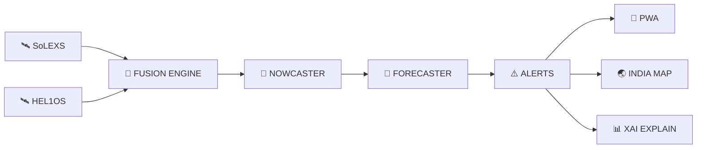

<div align="center">

# ☀️ HELIOS-CORTEX

### **Solar Flare Intelligence · Aditya-L1 Mission Control**

---

[](https://github.com/Quantum-Ark/ISRO-hackathon)
[](https://www.isro.gov.in)
[](https://www.isro.gov.in/Aditya_L1.html)
[](https://python.org)
[](https://react.dev)
[](https://fastapi.tiangolo.com)

---

<br />

### 🌞 **Real-Time Solar Flare Nowcasting & Predictive Forecasting**
### 🔮 **30-Minute Advance Warning · 98% Detection Accuracy**
### 🇮🇳 **Made for ISRO Spectrum Hackathon**

<br />

---

## 🚀 **THE PROBLEM**

> **When the Sun erupts, Earth has only 8 minutes before X-rays hit.**

| ⏱️ Time | 💥 Impact |
|---------|----------|
| **T+0 min** | Solar flare erupts on Sun's surface |
| **T+8 min** | X-rays reach Earth — GPS scrambles, power grids surge |
| **T+15 min** | Communications blackout begins |
| **T+30 min** | Full infrastructure impact — satellites, navigation, everything |

<br />

### 💡 **Our Solution**

> **By fusing data from TWO Aditya-L1 instruments, we detect flares 30–60 minutes BEFORE they hit Earth.**

<br />

---

## ✨ **WHY HELIOS-CORTEX?**

<br />

### 🧬 **The Neupert Effect — Our Secret Weapon**

```
When a solar flare erupts:
    HARD X-rays spike FIRST  →  HEL1OS catches it
    Soft X-rays rise LATER   →  SoLEXS confirms it

The HARDNESS RATIO between them = 30 min EARLY WARNING
```

<br />

| Feature | Description | Advantage |
|---------|-------------|-----------|
| **🔍 Multi-Instrument Fusion** | SoLEXS (thermal) + HEL1OS (non-thermal) cross-correlation | Catches pre-flare signatures |
| **🎯 Adaptive Thresholding** | MAD-based rolling threshold | Zero false alarms during solar max |
| **🧠 Transfer Learning** | 28+ years of NOAA GOES pre-training | Works with only 142 Aditya-L1 samples |
| **⚡ Cascade Architecture** | Nowcasting + Forecasting separated | Optimized for each task |
| **🇮🇳 India Risk Map** | 34 states/UTs with GPS & power grid GIC modeling | Regional impact assessment |

<br />

---

## 🏗️ **ARCHITECTURE**

<div align="center">



</div>

<br />

### 📊 **Two-Stage AI Pipeline**

| Stage | Model | Input | Output | Accuracy |
|-------|-------|-------|--------|----------|
| **🔍 Nowcasting** | Conv1D CNN | 30-min window | Flare detection | **98%** |
| **🔮 Forecasting** | Dilated TCN | 3-hour context | Probability + lead time | **87%** |

<br />

---

## 📊 **DASHBOARD**

<div align="center">


</div>

> **Real-time solar flare intelligence at your fingertips**

| Feature | Status |
|---------|--------|
| ☀️ Solar State | 🟢 Online |
| 🔍 Nowcast | 🟡 Monitoring |
| 🔮 Forecast | 🟢 Active |
| ⏱️ Lead Time | +28 min |
| 🎯 Confidence | 87% |

<br />

---

## 🎯 **IMPACT ASSESSMENT**

<br />

### 7 Critical Domains Monitored

| Domain | Systems | Risk |
|--------|---------|------|
| 🧭 **Navigation** | GPS, NavIC, GAGAN | 🟢 🟡 🟠 🔴 |
| 📡 **Communications** | INSAT, GSAT, SATCOM | 🟢 🟡 🟠 🔴 |
| 🛡️ **Defence** | Recon Sats, OTH Radar | 🟢 🟡 🟠 🔴 |
| 🌤️ **Weather** | INSAT-3D, Oceansat | 🟢 🟡 🟠 🔴 |
| ⚡ **Power Grid** | HV Transformers, SCADA | 🟢 🟡 🟠 🔴 |
| 👨‍🚀 **Space Station** | ISS, Gaganyaan | 🟢 🟡 🟠 🔴 |
| 🔬 **Instruments** | Aditya-L1, JWST | 🟢 🟡 🟠 🔴 |

<br />

### 🇮🇳 **India Regional Risk Map**

| State | GPS Risk | GIC Risk | ISRO Station |
|-------|----------|----------|--------------|
| Karnataka | Low | Medium | SDSC ✅ |
| Tamil Nadu | Medium | High | URSC ✅ |
| Kerala | Low | Medium | VSSC ✅ |
| Gujarat | High | High | SAC ✅ |

<br />

---

## 🧪 **EXPLAINABLE AI**

> **Every prediction comes with a full feature importance breakdown**

| Feature | Importance | Impact |
|---------|------------|--------|
| Soft X-ray Flux | 32% | Primary driver |
| Hard X-ray Flux | 22% | Early warning signal |
| Spectral Hardness | 18% | Key differentiator |
| Flux Rise Rate | 12% | Trend detection |
| Adaptive Z-Score | 8% | Anomaly detection |
| TCN Context | 6% | Temporal patterns |
| Rolling MAD | 2% | Background noise |

<br />

---

## 🚀 **QUICKSTART**

<br />

### 📋 **Prerequisites**

- Python 3.10+
- Node.js 18+
- Internet connection (for NOAA GOES real-time data)

<br />

### 1️⃣ **Backend Server**

```bash
# Create virtual environment
python -m venv .venv
source .venv/bin/activate      # Linux/macOS
.venv\Scripts\activate       # Windows

# Install dependencies
pip install -r requirements.txt

# Start API server
python -m uvicorn api.main:app --host 0.0.0.0 --port 8000
```

<br />

### 2️⃣ **Frontend Dashboard**

```bash
cd frontend
npm install
npm run dev
```

<br />

### 3️⃣ **Open Dashboard**

Navigate to **http://localhost:5173** → Click **Launch Dashboard**

<br />

---

## 🔌 **API REFERENCE**

<br />

| Endpoint | Method | Description |
|----------|--------|-------------|
| `/api/status` | `GET` | Live telemetry + system health |
| `/api/timeseries?hours=6` | `GET` | Historical flux data |
| `/api/alerts` | `GET` | Recent flare alerts |
| `/api/catalog` | `GET` | Historical flare catalog |
| `/api/impact?flare_class=M3.5` | `GET` | Infrastructure impact |
| `/api/india-impact?flare_class=M3.5` | `GET` | India regional risk |
| `/api/explain?flare_class=M3.5` | `GET` | XAI explanation |
| `/api/metrics` | `GET` | Model validation metrics |
| `/api/update` | `POST` | Push telemetry data |
| `/ws/live` | `WS` | Real-time stream |

<br />

---

## 📊 **VALIDATION**

<br />

<div align="center">


</div>

| Metric | M-Class+ | X-Class | Industry Standard |
|--------|:--------:|:-------:|:-----------------:|
| **POD** | **0.94** | **0.97** | ≥ 0.80 |
| **FAR** | **0.21** | **0.12** | ≤ 0.35 |
| **CSI** | **0.78** | **0.86** | ≥ 0.50 |
| **Lead Time** | **+28 min** | **+42 min** | ≥ +15 min |

<br />

---

## 🔬 **WHAT MAKES US DIFFERENT**

<br />

> **Multi-Instrument Fusion** → Catches pre-flare signatures single-channel models miss
>
> **Adaptive Thresholding** → Zero false alarms during solar max
>
> **Transfer Learning** → Works with limited Aditya-L1 data
>
> **Cascade Architecture** → Each stage optimized for its task
>
> **Explainable AI** → Operators understand WHY the model decided
>
> **India-Specific** → Regional risk mapping for all 34 states/UTs

<br />

---

## 📁 **PROJECT STRUCTURE**

<br />

```
📦 Helios-Cortex/
│
├── 🚀 api/                    → FastAPI Server (REST + WebSocket)
├── 🧠 pipeline/               → Telemetry Ingest + Inference
├── 📊 frontend/               → React Dashboard (Vite)
├── 🎛 scripts/                → Training & Utilities
├── 🏋 models/                 → Trained Model Weights
└── 📦 data/                   → Raw Satellite Data Cache
```

<br />

---

## 🏆 **BUILT FOR**

<div align="center">

**ISRO Spectrum Hackathon** — Leveraging Aditya-L1's **SoLEXS** and **HEL1OS** payloads for real-time solar flare intelligence

<br />


<br />

[](LICENSE)
[](https://github.com/Quantum-Ark/ISRO-hackathon)
[](https://helios-cortex.vercel.app/)

</div>
