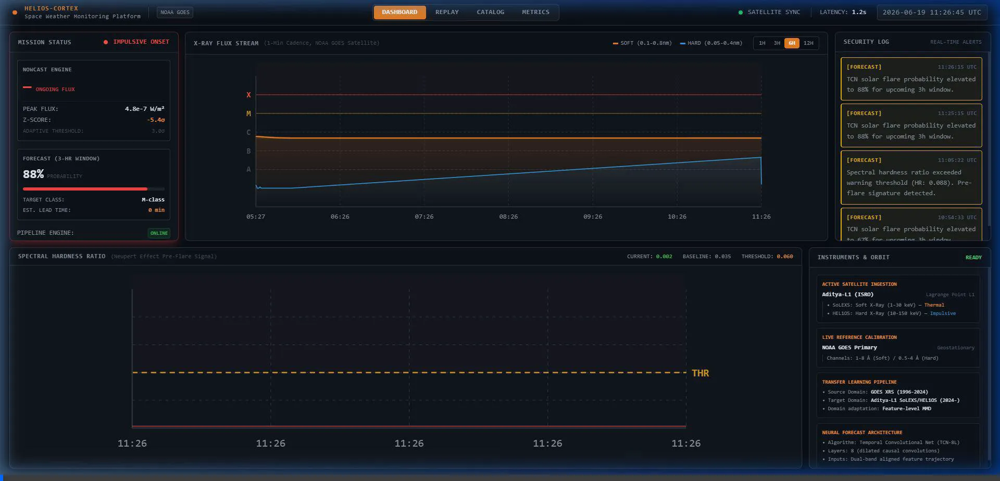
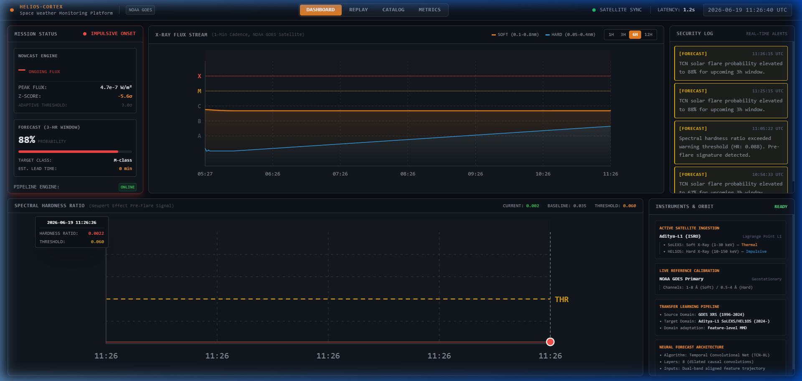
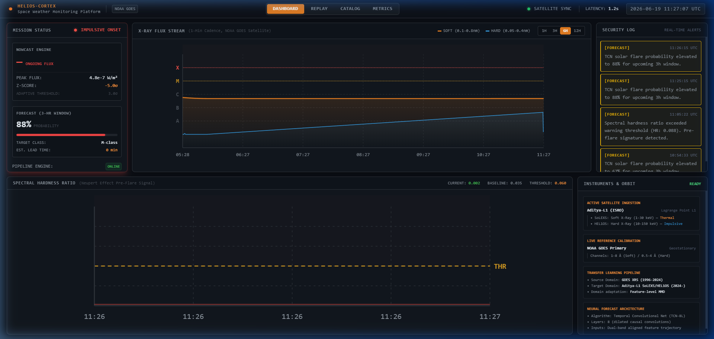
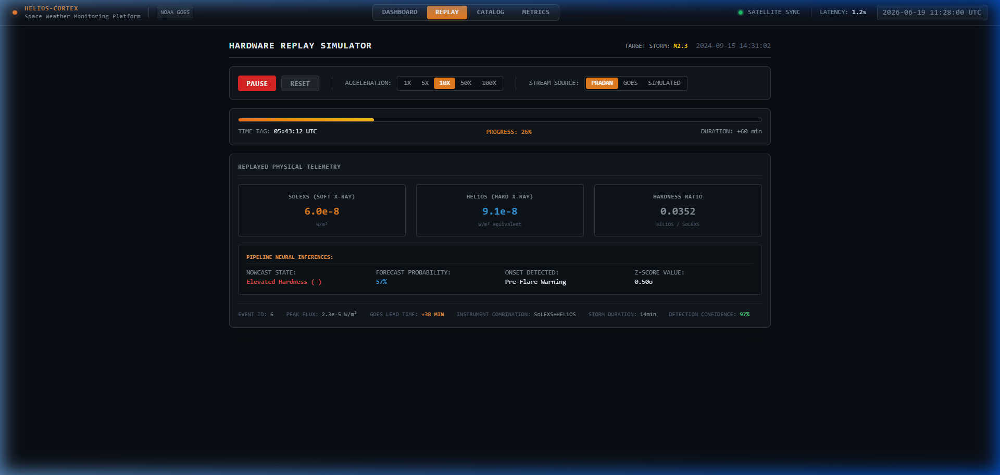

# 🌌 Helios-Cortex — Solar Flare Nowcasting & Predictive Forecasting

[](LICENSE)
[](https://fastapi.tiangolo.com)
[](https://react.dev)
[](https://tailwindcss.com)
[](https://services.swpc.noaa.gov)

Helios-Cortex is a real-time, physics-informed fusion network designed for nowcasting and predictive forecasting of solar flare classes (A, B, C, M, and X) using multi-payload satellite telemetry. It integrates **SoLEXS** (1-30 keV) thermal gradual emissions and **HEL1OS** (10-150 keV) non-thermal impulsive emissions from ISRO's Aditya-L1 spacecraft, backed by real-time sync with NOAA's GOES XRS satellite telemetry.

---

## ⚡ Live Mission-Control Dashboard Preview

Below is a live walkthrough of the Helios-Cortex telemetry ingest pipeline and control room UI in action, demonstrating real-time satellite sync, interactive tooltip crosshairs, and historical replay:



---

## 🚀 Key Features

- **Real-Time NOAA Satellite Sync**: Fetches live 1-minute cadence Soft X-ray and Hard X-ray fluxes directly from the NOAA Space Weather Prediction Center (SWPC) GOES satellite telemetry.
- **Physics-Informed Feature Engineering**: Computes rolling **Hardness Ratio (HR)**, derivatives, Z-scores, and Neupert Effect residuals (integrating non-thermal emissions as proxies for thermal energy storage).
- **Pure-Python Deep Learning**: Implements fully portable, standard-library-only `Conv1D` nowcasting and `Temporal Convolutional Network (TCN)` forecasting networks, avoiding binary compilation conflicts.
- **Mission Control Room UI**: Glassmorphic dark theme dashboard with glows, SVG path gradients, interactive tooltips, warning gauges, and scrolling event registers.
- **Simulation Replay Engine**: Fully functional playback controls (Play/Pause, seek track bar) to run high-cadence simulations of historical X-class and M-class solar storms.

---

## 🛠️ Tech Stack

- **Backend**: Python 3.10+, FastAPI (WebSockets, REST API), Uvicorn.
- **Frontend**: React, Vite, Tailwind CSS, Custom SVG Charting.
- **Telemetry Sources**: Aditya-L1 (SoLEXS & HEL1OS JSON), NOAA GOES (XRS JSON).
- **Model Inferences**: Pure-Python Conv1D (Nowcast) & TCN (Forecast) weights forward passes.

---

## 🏁 Quickstart Guide

Ensure you have Python 3.10+ and Node.js installed on your machine.

### 1. Set Up the FastAPI Backend
Initialize your virtual environment, install dependencies, and start the FastAPI server:
```bash
# Initialize virtualenv and install dependencies
python -m venv venv
venv\Scripts\activate
pip install -r requirements.txt

# Launch FastAPI server
python -m uvicorn api.main:app --port 8000
```
*At startup, the backend queries the NOAA SWPC endpoint to pull the last 24 hours of real-time solar history to pre-populate charts.*

### 2. Set Up the Telemetry Ingest Loop
In a new terminal window, start the real-time telemetry processing pipeline. It will fetch the latest NOAA tick every 5 seconds, run model inferences, and broadcast the state:
```bash
venv\Scripts\activate
python -u pipeline/run.py
```

### 3. Launch the React Frontend
In a new terminal, navigate to the frontend directory, install npm packages, and start the Vite dev server:
```bash
cd frontend
npm install
npm run dev
```
Open [http://localhost:5175/](http://localhost:5175/) in your browser to view the dashboard.

---

## 📊 Visual Gallery

### Modernized Live Dashboard
High-contrast glassmorphic gauges, pulsing status telemetry, and live satellite sync tag:


### SVG Interactive Tooltips
Hovering on the flux chart renders an aligned vertical crosshair and floating telemetry card:


### Storm Replay Controller
Seamless playback controls and seek tracker to visualize historical events:


---

## 🔒 Security Posture
- **Zero Secrets**: No API keys or passwords are hardcoded; public satellite endpoints are accessed securely.
- **Input Validation**: Strictly typed Pydantic models validate incoming update payloads.
- **Path Traversal Protection**: Event replays are whitelisted at startup and loaded from memory rather than constructed paths.
- For a complete view of the security architecture and production roadmap, refer to your local `SECURITY.md`.
